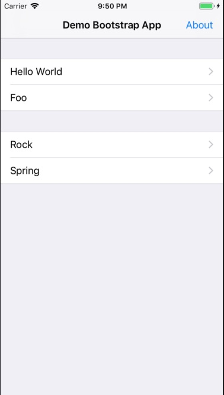

#  Ứng dụng demo có nhiều màn hình chi tiết

## Mô tả ứng dụng

Đây là ứng dụng mà ta có thể thêm màn hình mới rất nhanh, không phải chỉnh sửa code hay sửa đổi StoryBoard.



Mấy điểm lưu ý ứng dụng này:

1. Nó không sử dụng main story board
2. AppDelegate.swift sẽ gọi đến BootLogic. BootLogic sẽ thực hiện khởi tạo dữ liệu menu Sections -> Menu
3. Cấu trúc dữ liệu của Section và Menu lưu ở file Menu.swift . Một menu item sẽ trỏ vào một UIViewController.
Việc UIViewController có XIB file đi cùng thì nó phải chủ động tự khởi tạo
4. MainScreen là một UITableViewController hiện thị các menu phân nhóm theo section. Từ MainScreen sẽ đi đến các màn hình
5. Cần chú ý là khi người dùng chọn một màn hình, ứng dụng có được một đoạn string tên của UIViewController. Chúng ta phải sử dụng kỹ năng Swift reflection để từ string dựng lại Class. Rồi từ Class khởi tạo object

Xem MainScreen.swift hàm hứng sự kiện người dùng tab một row trong bảng
```
override func tableView(_ tableView: UITableView, didSelectRowAt indexPath: IndexPath) {
    let section = sections![indexPath.section]
    let menu = section.menu[indexPath.row]
    let appName = Bundle.main.infoDictionary![kCFBundleNameKey as String] as! String
    let identifier = appName + "." + menu.identifier

    //Tạo kiểu Class từ string
    let ViewControllerClass = NSClassFromString(identifier) as! UIViewController.Type

    //Init đối tượng từ Class
    let detailScreen = ViewControllerClass.init()

    self.navigationItem.backBarButtonItem = UIBarButtonItem(title: "", style: .plain, target: nil, action: nil)
    self.navigationController?.pushViewController(detailScreen, animated: true)
}
```

## Các bước thực hiện

1. Tạo ứng dụng SingleView App, nhưng chúng ta sẽ không sử dụng StoryBoard. [Tham khảo hướng này](http://lab.dejaworks.com/making-ios-swift-app-without-storyboard-just-programmatically/)
2. Sửa AppDelegate.swift như sau

```swift
func application(_ application: UIApplication, didFinishLaunchingWithOptions launchOptions: [UIApplication.LaunchOptionsKey: Any]?) -> Bool {
    self.window = UIWindow(frame: UIScreen.main.bounds)

    // Garantiee the window in not nil
    guard let window = self.window else { fatalError("No Window") }

    BootLogic.boot(window: window)


    // Make it visible
    window.makeKeyAndVisible()
    return true
}
```

3. Thứ tự gọi sẽ như sau:

AppDelegate -> BootLogic -> MainScreen -> whatever DetailScreen

4. Chú ý hãy gom các màn hình chi tiết vào group Screens
