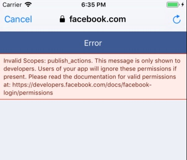

#  Hướng dẫn sử dụng Facebook Login SDK

## Biên dịch với Swift 4.2, XCode 10.1

Hãy dùng Pod file như sau
```
target 'facebookapp' do
use_frameworks!
pod 'FacebookCore'  #(0.5.0)
pod 'FacebookLogin' #(0.5.0)
pod 'FacebookShare' #(0.5.0)
pod 'FBSDKCoreKit', '~> 4.38.0'
pod 'FBSDKLoginKit', '~> 4.38.0'
pod 'FBSDKShareKit', '~> 4.38.0'
pod 'SteviaLayout'

end
```

## Một số vấn đề gặp phải
Nếu dùng publish action
```
let loginButton = LoginButton(publishPermissions: [.publishActions])
```
Tuy nhiên sau khi login sẽ gặp phải lỗi này



## Account Kit
https://developers.facebook.com/docs/accountkit/overview/
Để có app ID phải vào Apple Developer Account
```xml
<plist version="1.0">
<dict>
...
<key>FacebookAppID</key>
<string>{your-app-id}</string>
<key>AccountKitClientToken</key>
<string>{your-account-kit-client-token}</string>
<key>CFBundleURLTypes</key>
<array>
<dict>
<key>CFBundleURLSchemes</key>
<array>
<string>ak{your-app-id}</string>
</array>
</dict>
</array>
...
</dict>
</plist>Copy Code
````
