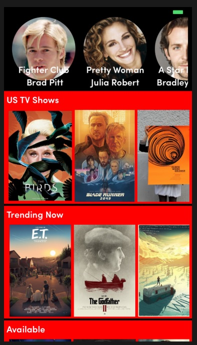
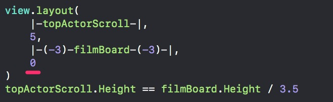

#  Một số kinh nghiệm khi lập trình layout giao diện

**Hãy tô màu sặc sỡ các vùng UIView cảm thấy nghi ngờ về kích thước**



Nếu thấy một số view bị biến mất hãy dùng lệnh
```swift
print(view.bounds)
print(view.frame)
```
**Luôn gọi self.init(frame: CGRect.zero) trong hàm convenience int**

Một lỗi gây ra treo ứng dụng đó là quên không gọi hàm init có frame. Đây là lời gọi có tính thủ tục, tạm thời truyền vào CGRect.zero
```swift
import Stevia

class FilmBoard: UIView {
    convenience init() {
        self.init(frame: CGRect.zero)
```

**Nếu chiều cao của view là 0 hãy kiểm tra margin top và bottom**



Khi layout nếu không có margin top và bottom, view bên trong không được kéo dãn. Kết quả là nó sẽ bằng 0.

**Layout phần tử trong UIScrollView**

UIScrollView có thuộc  tính contentSize kiểu CGSize. Tại hàm init, chương trình chưa thể tính toán được ngay kích thước thật của UIScrollView mà chỉ cài đặt cấu hình layout và constraint thôi.

Do đó chúng ta phải override hàm  layoutSubviews. Chú ý phải gọi super.layoutSubviews() vì hàm này thực sự tính toán kích thước UIScrollView.

Sau khi có kích thước của UIScrollView tiếp tục đặt các view con vào trong UIScrollView

```swift
override func layoutSubviews() {
        super.layoutSubviews()
        //Đảm bảo có 2 scroll view và một phần label của scroll view thứ 3 trong vùng nhìn được
        let filmscroll_height = (self.bounds.height - 50)/2 //Chừa ra một đoạn 50 pixel để label scrollview 3 trồi lên
        for (i, filmscroll) in self.subviews.enumerated(){
            filmscroll.frame = CGRect(x: 0,
                                      y: CGFloat(i) * (filmscroll_height + 4.0),
                                      width: self.bounds.width,
                                      height: filmscroll_height)
            
        }
        self.contentSize = CGSize(width: self.bounds.width, height: CGFloat(self.subviews.count) * (filmscroll_height + 4.0))
        
    }
```
