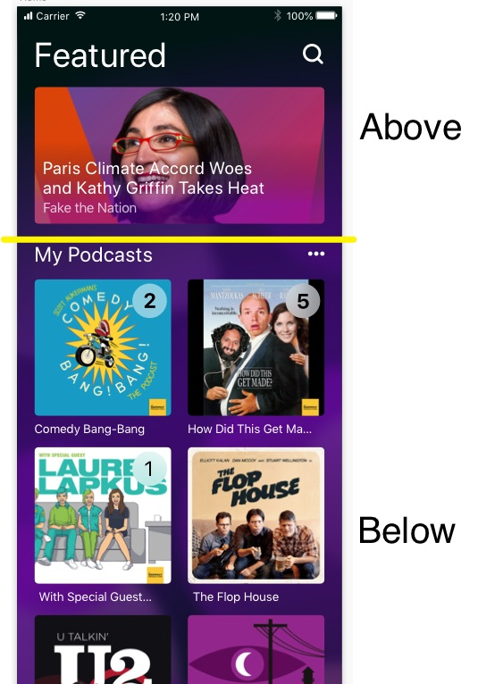
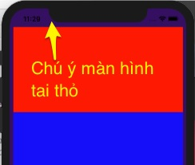

# Hướng dẫn từng bước làm ứng dụng PodCast App

## Phần khung căn bản
 
1. Tạo một SingleView app
2. Sử dụng Cocoa Pods để bổ xung thư viện Stevia
    ```bash
    pod init
    nano Podfile
    ```
    
    Nội dung Podfile
    ```
    target 'PodCastApp' do
      pod 'SteviaLayout'
      use_frameworks!
    end
    ```
    sau cài đặt bằng lệnh
    ```bash
    pod install
    ```

3. Ứng dụng này không dùng StoryBoard do đó
    - Xóa main.storyboard
    - Vào info.plist xóa key "Main storyboard file base name"
    - Xóa cả ViewController.swift
    - Bổ xung các dòng code sau vào AppDelegate.swift
        ```swift
        func application(_ application: UIApplication, didFinishLaunchingWithOptions launchOptions: [UIApplication.LaunchOptionsKey: Any]?) -> Bool {
        self.window = UIWindow(frame: UIScreen.main.bounds)
        
        // Garantiee the window in not nil
        guard let window = self.window else { fatalError("No Window") }
        
        window.rootViewController = MainScreen()
        
        
        // Make it visible
        window.makeKeyAndVisible()
        return true
        }
        ```
4. Tạo một class kế thừa UIViewController đặt tên là MainScreen

# Layout MainScreen
Hãy chia đôi màn hình thành 2 phần chính:
1. Above gồm label Featured và search icon, dưới thì có một UIScrollView chứa các
ảnh sẽ trượt ngang
2. Below gồm label MyPodcasts và icon ..., dưới có thể UITableView hoặc 
UICollectionView hoặc CollectionKit



## Tương tác của người dùng gồm có

1. Lướt ngang scroll view Features phần Above để xem các item mới
2. Lướt dọc scroll view My Podcasts phần Below
3. Chạm để nghe
4. Chạm icon Search để mở ra màn hình tìm kiếm

## Background màn hình thực chất có màu gradient

Phần này chưa phải quan trọng nên hãy để sau. Tuy nhiên tham khảo ở đây
[Become gradient master](https://blog.prototypr.io/become-a-gradient-master-with-cagradientlayer-c0fd87f7fe67)

Trước mắt hãy chọn màu tím thủy chung để làm background color
0x350e64. Hàm UIColor(rgb: 0x350e64) có được nhờ UIColor+extension.swift

```swift
import UIKit
import Stevia
class MainScreen: UIViewController {
    let Featured = UILabel(frame: CGRect.zero)
    let Search = UIImageView(frame: CGRect.zero)
    let viewAbove = UIView()
    let viewBelow = UIView()
    override func viewDidLoad() {
        super.viewDidLoad()
        view.backgroundColor = UIColor(rgb: 0x350e64)
        view.sv(
            viewAbove,
            viewBelow
        )
        
        view.layout(
            
        )
    }
}
```

## Layout 2 phần giao diện

```swift
 override func viewDidLoad() {
        super.viewDidLoad()
        view.backgroundColor = UIColor(rgb: 0x350e64)
        viewAbove.backgroundColor = UIColor.red
        viewBelow.backgroundColor = UIColor.blue
        view.sv(
            viewAbove,
            viewBelow
        )
        
        view.layout(
            |-viewAbove-| ~ 200,
            |-viewBelow-|,
            margin
        )
        viewAbove.Top == view.safeAreaLayoutGuide.Top
    }
```
Đoạn code dưới căn đỉnh của viewAbove chạm đúng vùng an toàn không đè vào vùng tai thỏ
```swift
viewAbove.Top == view.safeAreaLayoutGuide.Top
```
