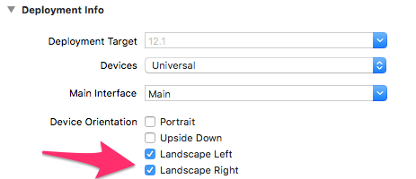
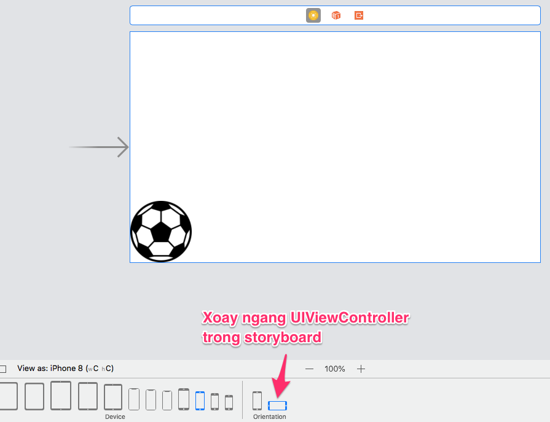

#  Rolling Ball

**Ứng dụng này dạy về:**
1. CGAffineTransform rotate
2. Cách tạo Timer vòng lặp
3. Làm sao để tạo hiệu ứng bóng lăn = vừa xoay quanh tâm vừa tịnh tiến theo phương ngang
4. Xoay ngang màn hình chế độ landscape


Ở bài này để bóng có quãng đường lăn đủ dài, ta cần xoay điện thoại sang chế độ landscape




```swift
quay góc tuyệt đối
ball.transform = CGAffineTransform.init(rotationAngle: CGFloat.pi/180)

quay góc tương đối
ball.transform = ball.transform.rotated(by: CGFloat.pi/180)
```

Cách nối tiếp 2 CGAffineTransform rotated + translatedBy không tạo hiệu quả mong muốn. Bóng di chuyển lung tung.
```swift
ball.transform = ball.transform.rotated(by: CGFloat.pi/180).translatedBy(x: 4, y: 0)
print("\(ball.center)")
```


Cách này sẽ giải quyết được vấn đề
```swift
ball.transform = ball.transform.rotated(by: CGFloat.pi/180)
ball_x = ball.center.x + (CGFloat.pi/180) * ballRadius!
if ball_x! > self.view.bounds.width {
    gameTimer.invalidate()
} else {
    ball.center = CGPoint(x: ball_x!, y: ball.center.y)
}
```
**Bài tập về nhà**
Hãy xây dựng hiệu ứng quả bóng rơi từ một độ cao H
