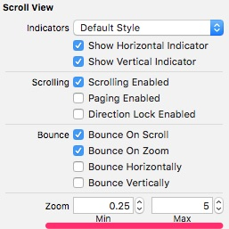
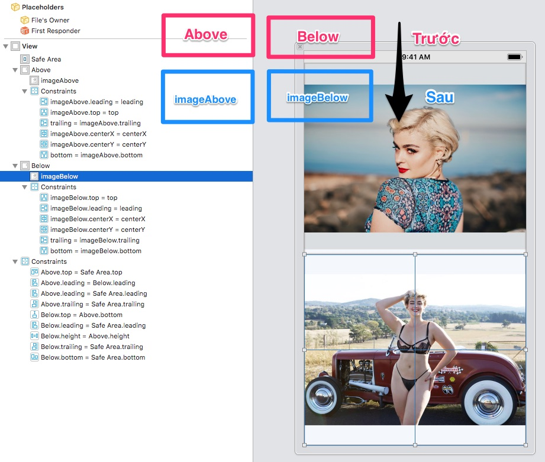

#  Demo UIScrollView

## Zoom: ứng dụng phóng ảnh bên trong một UIScrollView
1. UIViewController cần adopt protocol UIScrollViewDelegate
2. Đặt thuộc tính delegate của scrollview vào đối tượng UIViewController
```
scrollView.delegate = self
```
3. Viết hàm hứng sự kiện func viewForZooming(in scrollView: UIScrollView) -> UIView? 
```
func viewForZooming(in scrollView: UIScrollView) -> UIView? {
    return photo
}
```
4. Đặt giá trị zoomScale min và max cho UIScrollView 


## Sliding Photos: ứng dụng xem bộ nhiều ảnh trong UIScrollView

Mở rộng: hãy lấy bộ tác phẩm của Normal Rockwell về và hiển thị thông tin gồm ảnh, tiêu đề và năm sáng tác
[Vào đây để lấy ảnh](https://www.artrenewal.org/Artist/Index/15)

Chú ý thuộc tính UIScrollView.contentSize và cách hứng sự kiện người dùng tab lên ảnh
```swift
func setupControl() {
    scrollView.delegate = self
    scrollView.contentSize = computeScrollViewContentSize()
    for i in 0..<photos.count {
        let imageView = UIImageView(image: UIImage(named: photos[i]))
        imageView.contentMode = .scaleAspectFit
        imageView.frame = CGRect(x: margin + CGFloat(i) * (photo_width + margin), y: margin,
                                width: photo_width,
                                height: photo_height)
        imageView.tag = 100 + i
        imageView.isUserInteractionEnabled = true
        imageView.addGestureRecognizer(UITapGestureRecognizer(target: self, action: #selector(onImageTab(sender:))))
    
        scrollView.addSubview(imageView)
    }
}
```

## DelegateToBlock

Trong ví dụ demo này, chúng ta thử nghiệm 2 UIScrollView trong một màn hình UIViewController.

Bình thường UIViewController sẽ adopt UIScrollViewDelegate. Các hàm trong protocol UIScrollViewDelegate luôn phải có tham số UIScrollView để phân biệt
chính xác UIScrollView nào phát sinh sự kiện.

Cách khác là chúng ta tạo ra sub class của UIScrollView, có các thuộc tính nhận vào các hàm xử lý sự kiện của UIScrollViewDelegate
sau đó tự gán UIScrollView.delegate vào chính nó.

```swift
class ScrollViewBlock: UIScrollView, UIScrollViewDelegate {        
    var viewForZooming: (() -> UIView?)? = nil
    /*
     Hàm hứng sự kiện viewForZooming(in scrollView: UIScrollView) xịn của UIViewScrollViewDelegate
     Nó sẽ trả về hàm sẽ được gán vào thuộc tính viewForZooming của UIScrollView
    */
    func viewForZooming(in scrollView: UIScrollView) -> UIView? {
        return viewForZooming != nil ? viewForZooming!() : nil
    }
}
```

### Chú ý khi AutoLayout 2 ScrollView trong bài tập này

1. Luôn AutoLayout các view ngoài cùng trước. Kéo các cạnh của View trùng sát những những cạnh cần align
2. Chạy ổn định sau đó mới add subview. Cụ thể là:
    
    1. Above ScrollView và Below ScrollView trước. Sau khi layout ổn định đi tiếp bước 2
    2. Layout Image bên trong Above ScrollView. Layout ổn định tiếp bước 3
    3. Layout Image bên trong Below ScrollView.
    
3. Nếu layout  Parent  View rồi Sub View ngay, mà bỏ qua Parent View cùng cấp khác sẽ dẫn đến tình trạng xung đột. Do đó luôn layout các Parent View cùng cấp hoàn hảo mới vào Sub View trong từng Parent View


## Tham khảo chuyên sâu

1. [Understanding Scroll Views](https://www.objc.io/issues/3-views/scroll-view/)
2. [How to optimize UIScrollView with large numbers of images](https://stackoverflow.com/questions/10221591/how-to-optimize-uiscrollview-with-large-numbers-of-images)

## Bài tập nâng cao
1. Hãy tạo hiệu ứng ScrollView vô tận các ảnh lần lượt kéo qua màn hình vô tận
2. Hãy chuyển các ảnh màu sắc sang ảnh màu xám (gray scale). Khi chạm vào ảnh thì ảnh đó chuyển ảnh màu, và hiển thị thông tin chi tiết bức ảnh đó
Tham khảo [How can I convert an UIImage to grayscale in Swift using CIFilter?](https://stackoverflow.com/questions/43011332/how-can-i-convert-an-uiimage-to-grayscale-in-swift-using-cifilter?noredirect=1&lq=1)
